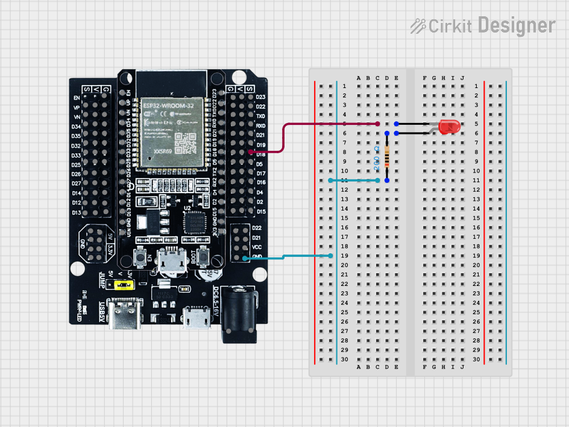

[Back to README](../README.md) | [Previous: Step 1](step1.md)

# Step 2: Add an External LED

Now you'll connect an external LED to your ESP32 and control it with code.

## What You'll Do
- Wire an LED and resistor to your ESP32
- Update your code to blink the external LED

## Instructions

1. **Disconnect your ESP32 from USB before wiring!**
2. Place the LED on your breadboard:
   - Long leg (anode) → GPIO 18 (use a jumper wire)
   - Short leg (cathode) → 220Ω resistor → GND

   
   

3. Reconnect your ESP32 to USB.
4. Open `main.py` and update your code:

**Before:**
```python
led = machine.Pin(2, machine.Pin.OUT)
```

**After:**
```python
led = machine.Pin(18, machine.Pin.OUT)
```

5. Save and run your code with Pymakr.

> **Note:** When you create a Pymakr project, it automatically creates an empty `main.py` file. Use this file for your code instead of creating a new one.

## What Should Happen?
- The external LED should blink on and off every second.

## Need Help?
- If the LED doesn't light, check the wiring and resistor value.
- Ask a classmate or your learning facilitator for help!

---

[Next: Step 3 - Add a Light Sensor](step3.md)
