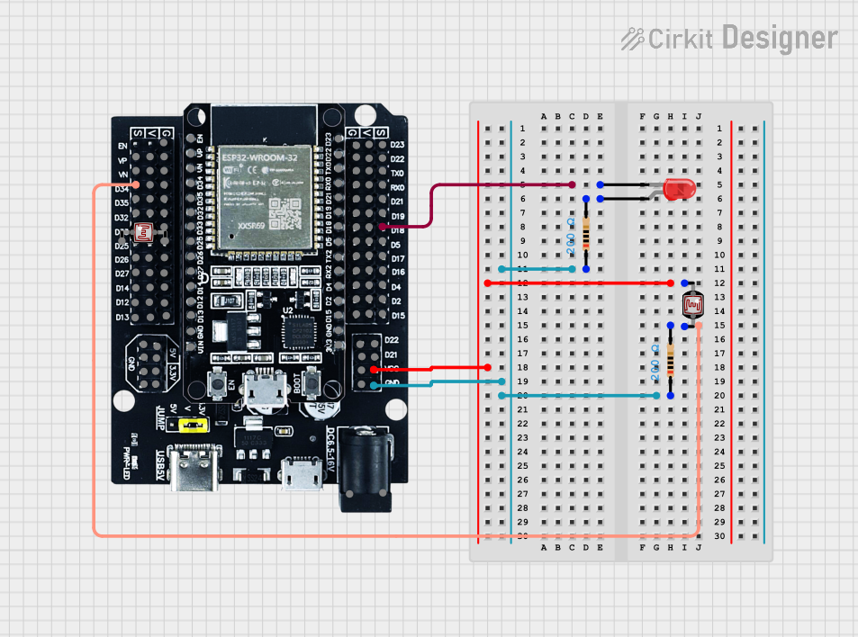

[Back to README](../README.md) | [Previous: Step 2](step2.md)

# Step 3: Add a Light Sensor

Make your nightlight turn on automatically when it's dark!

## What You'll Do
- Connect a photoresistor (LDR) and resistor to your ESP32
- Update your code to read the sensor and control the LED

## Instructions

1. **Disconnect your ESP32 from USB before wiring!**
2. Build a voltage divider circuit with the LDR and a 10kΩ resistor (see example diagram[1]):

   
   - Connect one end of the LDR (photoresistor) to the 3V3 (3.3V power) pin on your ESP32.
   - Connect the other end of the LDR to one leg of the 10kΩ resistor **and** to GPIO 34 (use a jumper wire from this junction to GPIO 34).
   - Connect the other leg of the 10kΩ resistor to GND (ground) on your ESP32.

   This creates a voltage divider: as the light level changes, the voltage at the junction between the LDR and resistor (which is connected to GPIO 34) will change. The ESP32 can read this voltage to sense brightness.
3. Reconnect your ESP32 to USB.
4. Open `main.py` and update your code:


**Add these lines at the top:**
```python
sensor = machine.ADC(machine.Pin(34))
sensor.atten(machine.ADC.ATTN_11DB)
THRESHOLD = 2000  # Adjust as needed
threshold = THRESHOLD  # Use a variable for easier adjustment later
```

**Update your loop:**
```python
while True:
    value = sensor.read()
    if value < threshold:
        led.on()
    else:
        led.off()
    time.sleep(0.2)
```

5. Save and run your code with Pymakr.

## What Should Happen?
- The LED should turn on when you cover the sensor and off when exposed to light.

## Need Help?
- If the LED doesn't respond, check your wiring and try adjusting the `THRESHOLD` constant in your code. Try values between 1000 and 3000 to see what works best for your sensor and room lighting.
- Ask a classmate or your learning facilitator for help!

---


🎉 You finished the Simple Nightlight Project!

---

[Next: Step 4 - Monitor Your Nightlight from a Web Browser](step4.md)

[1]: https://app.cirkitdesigner.com/project/da38fcdb-6c4b-447b-b10c-8b83463b7da1
